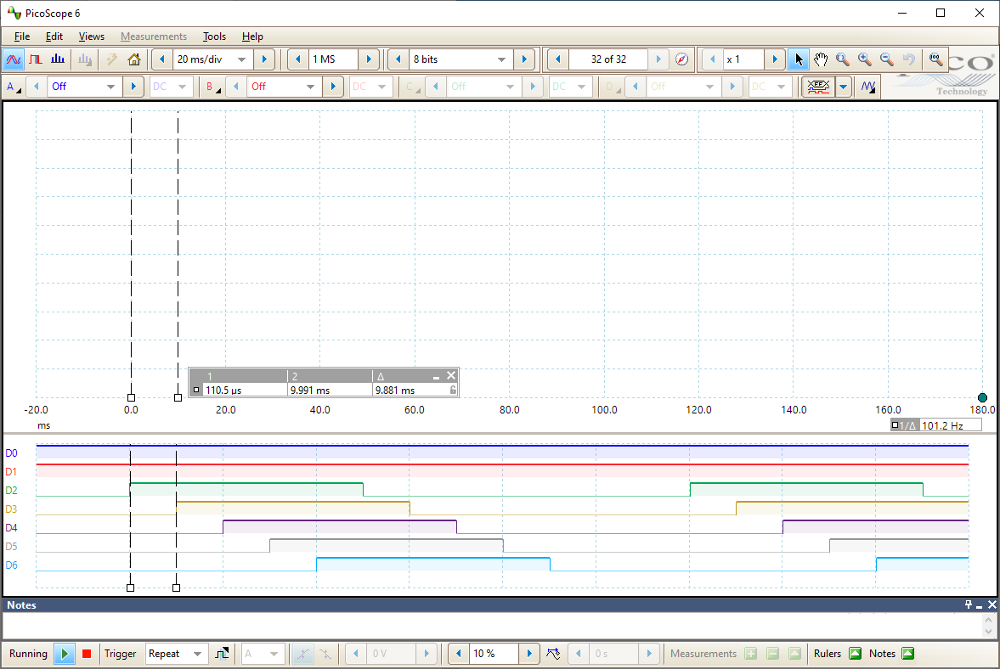

# Arduino_Playground
Misc Arduino Playground code

## IO

  

    digitalWrite_loop
  

  
  Utilize loops to modify pin states between high and low

  Pins are stored inside of array to simplify access.
  
  Utilization of constants resulted in reduction of file size.
  
  

  
  
